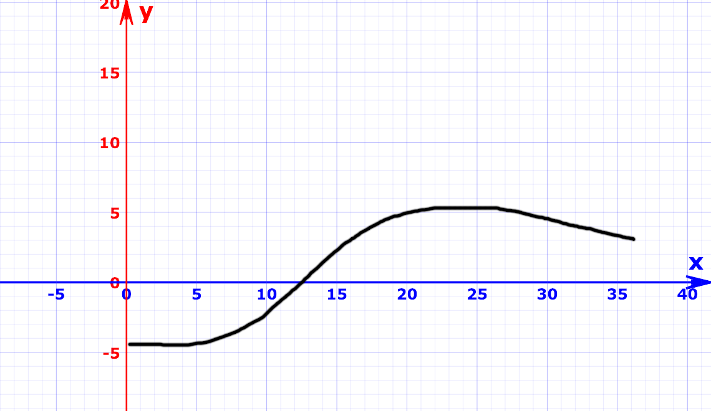

.. _part2:

Part 2
======

In part 2 we're going to make the sheep flock together and stop them
disappearing off the screen. To do this we're going to compute a force
of attraction between the sheep. This will make the sheep move towards
each other, and make them more interested in each other the closer they
get.

Later we'll also add an opposite force (a fear force) for the wolf so
that the sheep run away!

We're going to use a bit of maths to do this. Ready? Deep breath!

Here's two sheep that we want to bring closer together. The red line
is the force of attraction between them, you can see it works in a
straight line between the sheep.

So to calculate the force of attraction between two sheep we need to:
 1. find the distance between them -- we can easily find the
    difference in x and y values, and then we can use Pythagoras
    Theorem to compute the distance along the straight line
 2. use distance to compute a force of attraction that gets stronger as
    the sheep get closer together, that's how long the red line is
 3. find the angle from one sheep to another
 4. use the angle to move the sheep together.

Step 1: Distance with Pythagoras
--------------------------------

Add a new method to your *Animal* class callled *distance_to*: ::

    def distance_to(self, other):
        # Distances
        dx = self.x - other.x
        dy = self.y - other.y
        # Pythagoras
        return math.sqrt(dx**2 + dy**2)
  
Pythagoras states that the long edge of the right-angled triangle (the
hypotenuse) is equal to the square root of the base squared (the
difference in x) and the height squared (the difference in y).

Notice that to square something in Python we write :code:`something **
2`.

With this method we can now compute the distance between any two sheep
like this: ::

  asheep.distance_to(another_sheep)

Step 2: Compute a force of attraction
-------------------------------------

Let's add another method for this. Add this to your *Animal* class: ::

   def attraction_to(self, other):
        # Attraction gets stronger the closer the other gets
        d = self.distance_to(other)
        return min(2, 30 / d)

So if the sheep is 300 pixels away, the force is 30/300 = 0.1, quite
weak. At 30 pixels the force is 30/30 = 1, and at 15 pixels it is
30/15 = 2. This seems like a good start.

Now that we have the force, we can use it to move towards the other
sheep...

Step 3: Find the angle between two sheep
----------------------------------------

Have you met *sin*, *cos* and *tan* yet in maths? They are three very
handy functions that give us an angle if we know two sides of a
triangle. So we know the difference in x and the difference in y,
which means we can use *tan* to find the angle. Thanks `SOHCAHTOA`_

Add this method to your *Animal* class: ::

   def angle_to(self, other):
        return math.atan2(other.y - self.y, other.x - self.x)

Step 4: Use the angle to move the sheep
---------------------------------------

OK, so we know the angle, and we know the force, let's move our
sheep. But how? Our sheep understand changes in x and changes in y. If
we know the angle and the force, we can use *sin* and *cos* to compute
the x and y change. Thanks again `SOHCAHTOA`_!

This is almost the last new method in this part, again add it to your
*Animal* class: ::

    def move_by_attraction(self, other):
        angle = self.angle_to(other)
        fx = math.cos(angle) * self.attraction_to(other)
        fy = math.sin(angle) * self.attraction_to(other)
        self.x += fx
        self.y += fy

Final step: bring it all together
---------------------------------

OK, let's bring those 4 steps together in our *move* method. Change it
so that it looks like this:

.. code-block:: python
   :emphasize-lines: 2,3

    def move(self):
        for o in self.other_animals():
            self.move_by_attraction(o)

Finally we just need to write the method :code:`other_animals`, which
gives us all other animals as we don't want to move towards ourself!
::

   def other_animals(self):
        """All the animals except us"""
        return [a for a in Animal.all if a != self]
	    
Now *Run* and see what happens. Make sure you've created a few animals
first with :code:`Animals()`. There's a few bugs... note them down and have
a think about how we could solve them.

Bugs
----

Did you find some bugs? The big one is that these sheep end up on top of each other, which isn't very realistic. Also we often get a divide by zero error when the distance between sheep becomes zero. Oh and the sheep can leave the screen. 

Let's fix these bugs...

Not too close
-------------

Look in your `attraction_to` function and you can see that attraction is
equal to `min(2, 30 / d)`. We can make a graph of this function so that we can
see how it changes as the sheep get closer.

There are a few tools to draw graphs online, here's one on `Maths Is Fun`_

Let's irgnore the `min` function and just plot `30/x` (using `x` instead of `d` because that's what the graph tool wants):

Can you see that as the distance (x) decreases the force (y) gets
stronger and stronger, with the blue line rising very steeply once x is
less than 5.

What we want is for the force to decrease when the sheep gets closer
than a certain amount and to become negative when they get too close,
so that they don't overlap.

What would this kind of graph look like? It could look something like this:

That is actually a bit like the graph of `-cos(x)`, so let's try that in
our `attraction_to` function, change the yellow lines like so:

.. code-block:: python
   :emphasize-lines: 3

   def attraction_to(self, other):
        d = self.distance_to(other)
        return -math.cos(d)

When you run this you'll see that the sheep seem pretty happy with
where they are, that's because `d` is too big so let's make it smaller
by dividing it by 20.

.. code-block:: python
   :emphasize-lines: 3

   def attraction_to(self, other):
        d = self.distance_to(other)
        return -math.cos(d/20)

So now your sheep form one or more flocks. Do try other numbers
instead of 20 and see what you like.

If you want your sheep to move a bit slower, we can reduce the force
by multiplying by a number less than 1, try this:

.. code-block:: python
   :emphasize-lines: 3

   def attraction_to(self, other):
        d = self.distance_to(other)
        return 0.2 * -math.cos(d/20)
		   

Divide by Zero?
---------------

Because our function now uses `cos` we never get a divide by zero error :)

Leaving the screen
------------------

This happens less frequently now, so we can ignore it, but we will have to
fix it once we add a sheepdog, which is what we are doing next. 
	
Part 3 Coming Soon...
---------------------

.. _`SOHCAHTOA`: https://www.youtube.com/watch?v=PIWJo5uK3Fo&ab_channel=JonathanMann
.. _`Maths IS Fun`: https://www.mathsisfun.com/data/function-grapher.php
